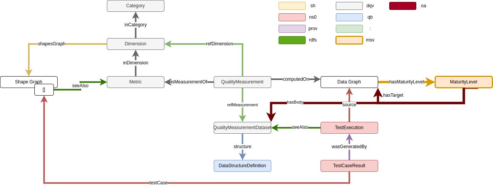

# rdf-maturitylevel-pipeline

A basic pipeline which has a dataset, a maturity model with levels and SHACL/RDFUnit shapes as an input and creates a ttl file used with JekyllRDF to display a report.

The [RdfProcessingToolkit](https://github.com/SmartDataAnalytics/RdfProcessingToolkit) does the most important steps in the workflow.

## Installation

You need [nextflow](https://www.nextflow.io/) and [docker](https://www.docker.com/) installed.

## Execution

`./nextflow run pipeline.nf`

This writes the turtle output in a file.

The input and output file destiantions have to be set in the *nextflow.config* file.
Also the namespace used for the dataset and the *dqv:QualityMeasurementDataset* has to be set in this file.

As examples we provide the *maturityModel/maturitymodel_for_vocabularies.ttl* file with the maturity model and in *maturityModel/tests/* exemplary tests for the metrics.
As the dataset file any *owl:Ontology* could be used.

## Idea

The workflow executed with nextflow does measure a datasets quality regarding a provided maturity model (based on the data quality vocabulary) using SHACL or RDFUnit tests and does provide a ttl file which does include all results.
These results are intended to be used by JekyllRDF.
An template could be found in https://github.com/stream-project/data_validation_with_shacl/blob/main/Jekyll-RDF/my_page2/_layouts/report.html

Existing vocabularies are used to make this possible.
Import ones are the *data cube vocabulary* and the *data quality vocabulary*.

##### Basic workflow (in german and colloquial)

1. RDFUnit wird mit Dataset und SHACL Graphen ausgeführt
2. Kombination: Maturity model, MSV? (instanzen müssen angepasst und andere gelöscht werden), RDFUnit results -> main.ttl
3. main.ttl wird modifiziert/erweitert:
  1. rdfs:seeAlso aus shapes extrahieren und in main.ttl einfügen
  2. dataset filename mit identifier ersetzen
  3. RDFUnit TestCaseResult testcase: darüber die Metric per prov:wasAssociatedWith verlinkt
  4. Erstellung eines QualityMeasurementDataset
  5. Pro Metric ein QualityMeasurement in welchem dqv:value über die Metric berechnet wird (maximalwert)
  6. Durch ValidationResults gehen und über testCase die Werte in den Quality Measurements auf 0 setzen
  7. Ratings von allen QualityMeasurement summieren und msv:hasRequiredRatingOf nutzen um passendes MaturityLevel zu identifizieren
  8. MaturityLevel ausgewähl und befüllt (oa:hasTarget und oa:hasBody) und eingefügt

## Issues

* SHACL test results are not connected to their SHACL shapes, see [issue on RDFUnit](https://github.com/AKSW/RDFUnit/issues/121)
* Jena has some issues with the *UUID* function in SPARQL, thus *iri:asGiven()* has to be used
* The inputs are not validated - no detection if a valid maturity model was provided and that tests are existing
